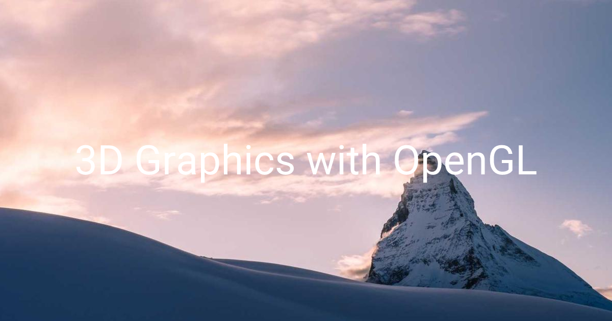
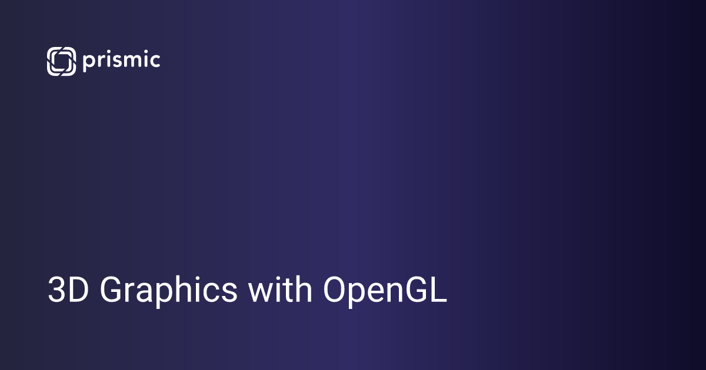
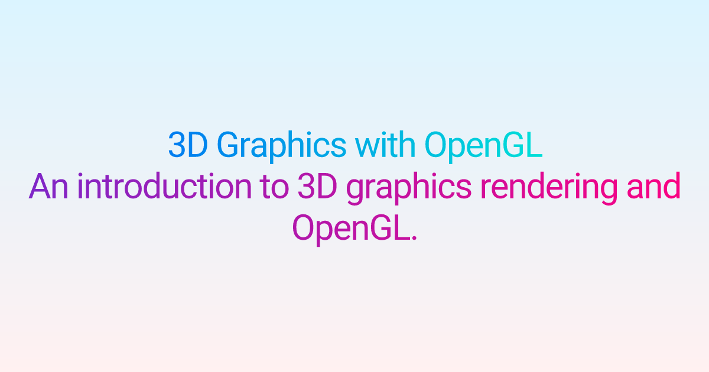
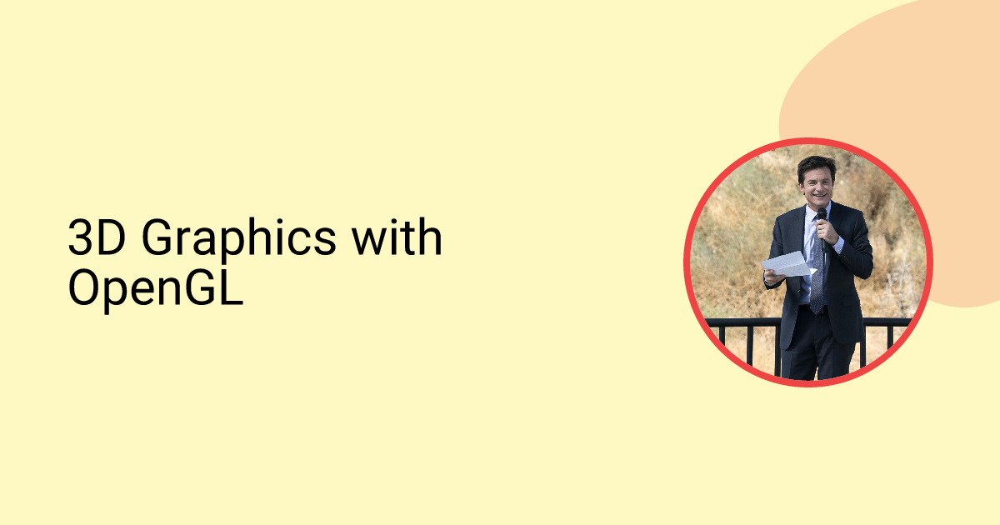
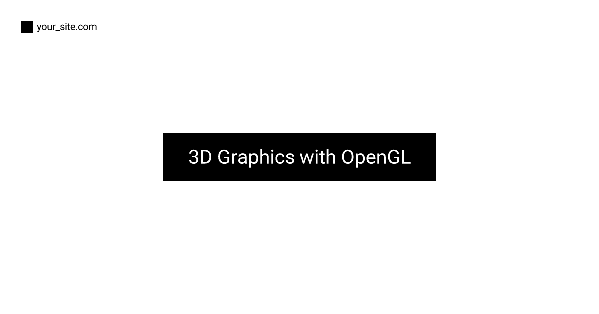
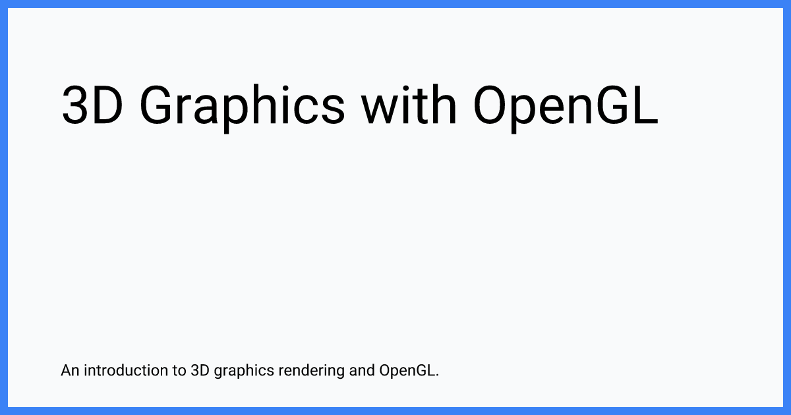
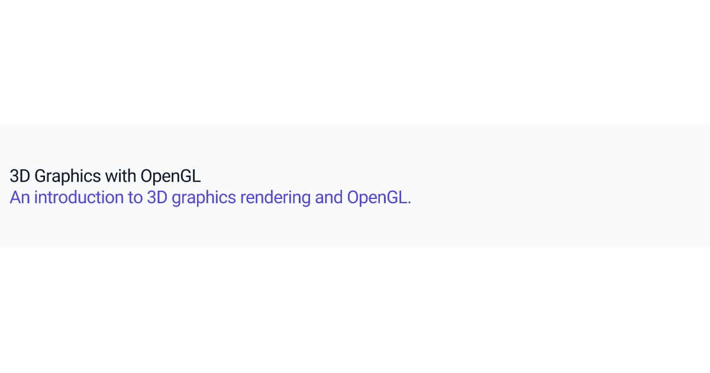
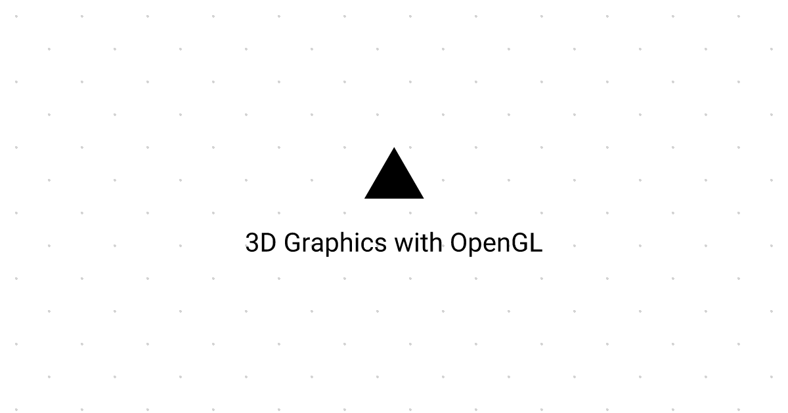
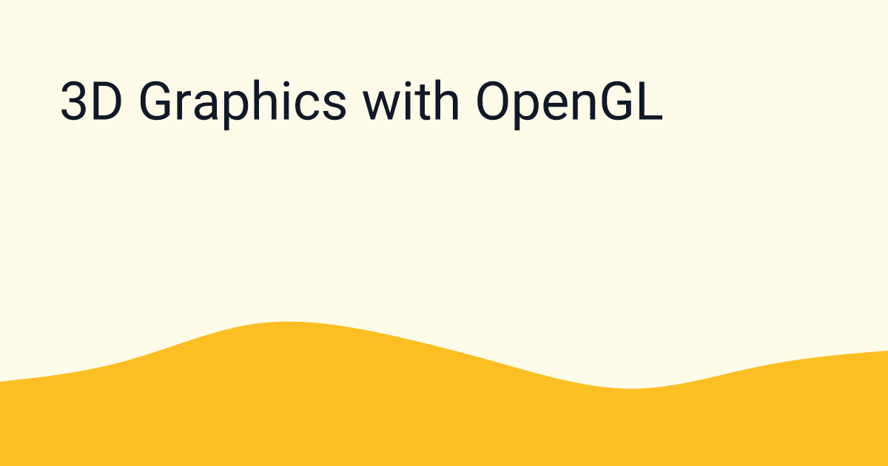

<div align="center">
  <picture>
    <source media="(prefers-color-scheme: dark)" srcset="https://cdn.rawgit.com/shepherdjerred/astro-opengraph-images/main/assets/logo-dark.png">
    <source media="(prefers-color-scheme: light)" srcset="https://cdn.rawgit.com/shepherdjerred/astro-opengraph-images/main/assets/logo-light.png">
    
  </picture>

[](https://www.npmjs.com/package/astro-opengraph-images)

Generate Open Graph images for your Astro site.

This project is actively maintained. If you have a feature request or need help, please [create an issue](https://github.com/shepherdjerred/astro-opengraph-images/issues/new).

</div>

## What is Open Graph?

[Open Graph](https://ogp.me/) is a protocol created by Facebook. It allows pages on your site to be richly embedded into other sites and applications.

You've probably seen this in action when posting a link on Facebook, Twitter, Slack, iMessage, or Discord. Links posted in supported applications will display the Open Graph metadata which often includes an image. This library will generate those images for you.

## Features

> [!WARNING]
> This integration has only been tested with statically rendered sites. It is untested with server-side rendering.

- Generate Open Graph images for every page on your site.
- Use a preset renderer to get started quickly.
- Images are fully customizable.
- Use React + Tailwind syntax or vanilla JavaScript to define your own custom images.
- Supports both static pages and Astro content collections.
- Pages can be written in Markdown, MDX, HTML, or any other format.

## Quick Start

1. Add this integration to your `astro.config.js`:

   - Option 1: use the `astro` command:

     ```bash
     npx astro add astro-opengraph-images
     ```

   - Option 2: install the package and add the integration to your `astro.config.js`:

     ```bash
     npm i astro-opengraph-images
     ```

     ```diff
     +import opengraphImages from "astro-opengraph-images";

     export default defineConfig({
       integrations: [
     +    opengraphImages()
       ],
     });
     ```

1. Install the fonts you want to use. Fonts must be explicitly declared to be used for images. System fonts are _not_ available. For this quick start guide, we'll install the [Roboto](https://fontsource.org/fonts/roboto) font.

   You can find more fonts on [Fontsource](https://fontsource.org/), or you can use any font file.

   ```bash
   npm i @fontsource/roboto
   ```

1. Configure the integration in your `astro.config.js` file:

   ```diff
   -import opengraphImages from "astro-opengraph-images";
   +import opengraphImages, { presets } from "astro-opengraph-images";

   export default defineConfig({
     integrations: [
   -    opengraphImages()
   +    opengraphImages({
   +      options: {
   +        fonts: [
   +          {
   +            name: "Roboto",
   +            weight: 400,
   +            style: "normal",
   +            data: fs.readFileSync("node_modules/@fontsource/roboto/files/roboto-latin-400-normal.woff"),
   +          },
   +        ],
   +      },
   +      render: presets.blackAndWhite,
   +    }),
     ],
   });
   ```

1. Update your layout to add the appropriate `meta` tags. The [OpenGraph site](https://ogp.me/) has more information about valid tags.

   ```diff
   ---
   + import { SEO } from "astro-seo";

   interface Props {
     title: string;
   }

   const { title } = Astro.props;
   +const { url, site } = Astro;
   ---

   <!doctype html>
   <html lang="en">
     <head>
       <meta charset="UTF-8" />
       <meta name="description" content="Astro description" />
       <meta name="viewport" content="width=device-width" />
       <link rel="icon" type="image/svg+xml" href="/favicon.svg" />
       <meta name="generator" content={Astro.generator} />
       <title>{title}</title>

   +     <SEO
   +       openGraph=\{\{
   +         basic: {
   +           title: title,
   +           // Add the correct type from https://ogp.me/#types
   +           type: "website",
   +           image: TODO: add some function to determine the URL at build time,
   +           url: url,
   +         },
   +         optional: {
   +           description: "My page description",
   +         },
   +       \}\}
   +     />
     </head>
     <body>
       <slot />
     </body>
   </html>
   ```

1. Confirm that your OpenGraph images are accessible. After you deploy these changes, navigate to [OpenGraph.xyz](https://www.opengraph.xyz/) and test your site.

## Presets

Presets are located in [`src/presets/`](https://github.com/shepherdjerred/astro-opengraph-images/tree/main/src/presets). [Open a pull request](https://github.com/shepherdjerred/astro-opengraph-images/compare) to contribute a preset you've created.

### backgroundImage



### blackAndWhite


### brandedLogo



### gradients



### podcast



### rauchg



### simpleBlog



### tailwind



### vercel



### waveSvg



## Custom Renderers

You can create your own custom images with a render function. Take a look at how [a preset](https://github.com/shepherdjerred/astro-opengraph-images/blob/main/src/presets/blackAndWhite.tsx) works.

This library uses [Satori](https://github.com/vercel/satori) to convert React components to SVG. The SVG is then converted to a PNG using [resvg-js](https://github.com/yisibl/resvg-js).

> [!TIP]
> Satori supports [a subset of CSS](https://github.com/vercel/satori?tab=readme-ov-file#css). Be sure to familiarize yourself with its limitations.
>
> You can use the [Satori playground](https://og-playground.vercel.app/) to work on your images.
>
> You can use Tailwind syntax with [tw-to-css](https://github.com/vinicoder/tw-to-css). An example is the [Tailwind preset](https://github.com/shepherdjerred/astro-opengraph-images/blob/main/src/presets/tailwind.tsx). You'll need to install this package yourself.

## Alternatives

Here are some similar libraries using Satori and Astro. I haven't done a feature comparison.

- https://github.com/florian-lefebvre/satori-astro (This library looks excellent)
- https://github.com/delucis/astro-og-canvas (Doesn't allow arbitrary layouts)
- https://github.com/thewebforge/astro-og-images (Only allows you to choose from a list of templates)
- https://github.com/tomaskebrle/astro-og-image (Seems limited)
- https://github.com/cijiugechu/astro-satori (Possibly dead, hasn't been updated in a year)
- https://github.com/kevinzunigacuellar/astro-satori (Possibly dead, hasn't been updated in a year)
- https://github.com/rumaan/astro-vercel-og (Possibly dead, hasn't been updated in a year)
