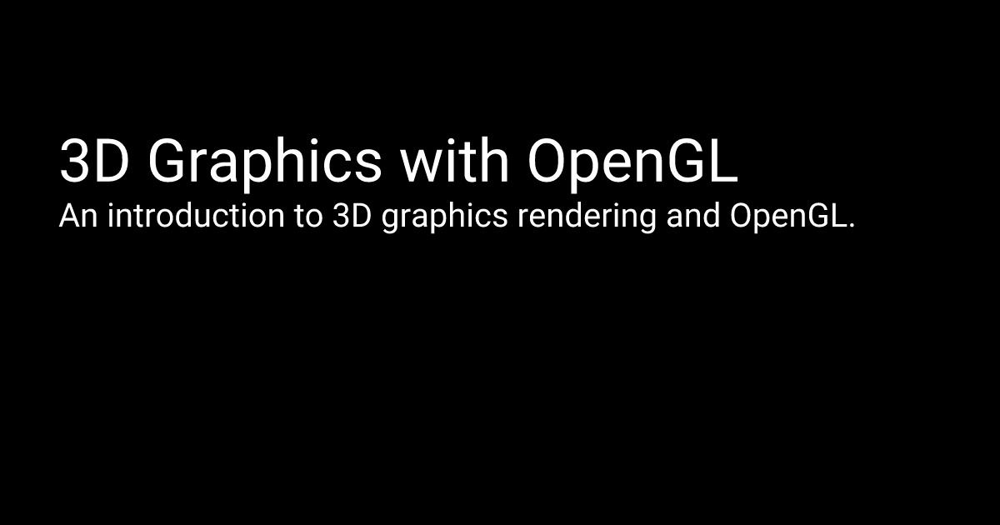

<div align="center">
  <h1>Astro OpenGraph Images</h1>

[](https://www.npmjs.com/package/astro-opengraph-images)

Generate fully customizable OpenGraph images for your entire Astro site with just a few lines of code.

This project is actively maintained. If you have a feature request or need help, please [create an issue](https://github.com/shepherdjerred/astro-opengraph-images/issues/new).

</div>

## Features

- Generate OpenGraph images for every page on your site.
- Use a preset renderer to get started quickly.
- Use React syntax or vanilla JavaScript to define your own custom images.
- Supports both static pages and Astro content collections.
- Pages can be written in Markdown, MDX, HTML, or any other format.

> [!WARNING]
> This integration has only been tested with statically rendered sites. It is untested with server-side rendering.

## Quick Start

1. Add this integration:

   - Option 1: use the `astro` command:

     ```bash
     npx astro add astro-opengraph-images
     ```

   - Option 2: install the package and add the integration to your `astro.config.js`:

     ```bash
     npm i astro-opengraph-images
     ```

     ```typescript
     import opengraphImages from "astro-opengraph-images";

     export default defineConfig({
       integrations: [opengraphImages()],
     });
     ```

1. Configure the integration in your `astro.config.js` file:

```typescript
// import presets
import astroOpenGraphImages, { presets } from "astro-opengraph-images";

// load any fonts you want to use
// either store these fonts with your project, or use `fetch` to download them when building
const path = new URL("./public/fonts/CommitMono/CommitMono-700-Regular.otf", import.meta.url);
const font = fs.readFileSync(path);

export default defineConfig({
  integrations: [
    opengraphImages({
      options: {
        width: 1200,
        height: 630,
        fonts: [
          {
            data: font,
            name: "Commit Mono",
            weight: 400,
            style: "normal",
          },
        ],
      },
      // use a preset render function to get started
      render: presets.blackAndWhite,
    }),
  ],
});
```

1. Update your layout to add the appropriate `meta` tags. The [OpenGraph site](https://ogp.me/) has more information about valid tags. At a minimum, you should define the tags below.

The integration will replace `[[OPENGRAPH IMAGE]]` with the path to the image it generated for that page. Note: `site` must be defined in your Astro config.

The image text comes from your page `<title />` and `<meta name="description" />` tags, so those should be defined.

```astro
---
const { url, site } = Astro;
---

<title>Your page title</title>

<meta name="description" content="Your page description" />

<meta property="og:title" content="" />
<meta property="og:type" content="" />
<meta property="og:url" content={url} />
<meta property="og:image" content={`${site?.toString()}[[OPENGRAPH IMAGE]]`} />
```

1. Confirm that your OpenGraph images are accessible. After you deploy these changes, navigate to [OpenGraph.xyz](https://www.opengraph.xyz/) and test your site.

## Presets

Presets are located in [`src/presets/`](https://github.com/shepherdjerred/astro-opengraph-images/tree/main/src/presets). [Open a pull request](https://github.com/shepherdjerred/astro-opengraph-images/compare) to contribute a preset you've created.

Here are the current presets:

### Black and White

This is what I use for my personal blog. It's a good starting point for creating your own custom images.



## Custom Renderers

You can create your own custom images with a render function. Take a look at how [a preset](https://github.com/shepherdjerred/astro-opengraph-images/blob/main/src/presets/blackAndWhite.tsx) works.

This library uses [Satori](https://github.com/vercel/satori) to convert React components to SVG. The SVG is then converted to a PNG using [resvg-js](https://github.com/yisibl/resvg-js).

> [!TIP]
> Satori supports [a subset of CSS](https://github.com/vercel/satori?tab=readme-ov-file#css). Be sure to familiarize yourself with its limitations.
>
> You can use the [Satori playground](https://og-playground.vercel.app/) to work on your images.

## Alternatives

Here are some similar libraries using Satori and Astro. I haven't done a feature comparison.

- https://github.com/florian-lefebvre/satori-astro (This library looks excellent)
- https://github.com/delucis/astro-og-canvas (Doesn't allow arbitrary layouts)
- https://github.com/thewebforge/astro-og-images (Only allows you to choose from a list of templates)
- https://github.com/tomaskebrle/astro-og-image (Seems limited)
- https://github.com/cijiugechu/astro-satori (Possibly dead, hasn't been updated in a year)
- https://github.com/kevinzunigacuellar/astro-satori (Possibly dead, hasn't been updated in a year)
- https://github.com/rumaan/astro-vercel-og (Possibly dead, hasn't been updated in a year)
